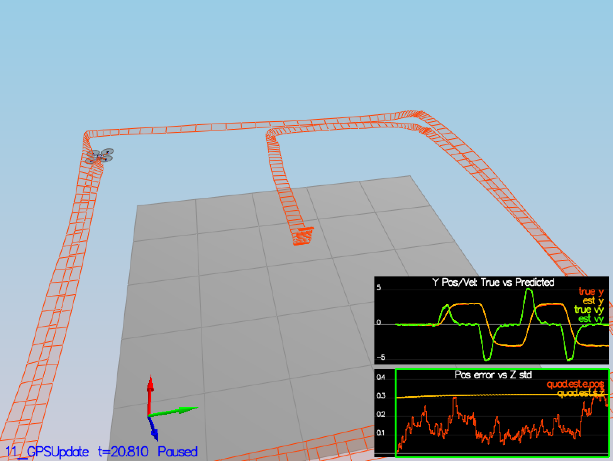

# Project : Building an Estimater

## Writeup / README

Provide a Writeup / README that includes all the rubric points and how you addressed each one. You can submit your writeup as markdown or pdf.

- This WriteUp.md includes the rubric points and explain how I addressed each point.

## Implement Estimator

### Step 1: Sensor Noise
Determine the standard deviation of the measurement noise of both GPS X data and Accelerometer X data.

- First Calculate std of GPS X data and Accelerometer X data
- Updtate MeasuredStdDev_GPSPosXY, MeasuredStdDev_AccelXY

~~~
import sys
import numpy as np

if len(sys.argv) < 2:
  print("Usage : calc_std.py filename")
  exit()

filename = sys.argv[1]
data = np.loadtxt(filename, delimiter=',', dtype='Float64', skiprows=1)

pos_x = data[:,1]
print('data length = ', len(pos_x), ', std = ', np.std(pos_x))
~~~

### Step 2 : Attitude Estimation
Implement a better rate gyro attitude integration scheme in the UpdateFromIMU() function.

- Use Quaternion to integrate roll, pitch, yaw with gyro sensor values.
~~~
  Quaternion<float> q = Quaternion<float>::FromEuler123_RPY(rollEst, pitchEst, ekfState(6));
  q.IntegrateBodyRate(gyro, dtIMU);
  q.Normalise();

  float predictedRoll = q.Roll();
  float predictedPitch = q.Pitch();
  ekfState(6) = q.Yaw();
~~~

### Step 3 : Prediction Step
Implement all of the elements of the prediction step for the estimator.

- This is the EKF Prediction Step
  1. Update U_t_bar = g(U_t, Commanded control)
     Use sensor value instead of Commanded control
  2. get gPrime Jacobian matrix
  3. Update Covariance
- Reference : 7.2 Transition Model

- The Following picture shows estimated state follows actual state
  The drift is small but eventually shows quite a drift.

- Tune QPosXYStd, QVelXYStd in uadEstimatorEKF.

### Step 4 : Magnetometer Update
Implement the magnetometer update.

- This is implementing of Update (2nd stage of EKF )
- Magnetometer cares only yaw value, ekfState(6).
- Reference 7.3.2 Magnetometer

### Step 5 : GPS Update
Implement the GPS update.

- Another Implementation of Update.
- GPS cares Position and Velocity.
- Reference 7.3.1 GPS

### Step 6 : Adding Your Controller

- Replace QuadController.cpp with my own and update Calibration files.
- This is the result of all scenario pass. [log.txt](./report/log.txt)
